
**Data Mining**
**24th December2020**

# Data Classification

# **Preprocessing**

**Reading data**

Reading the data from wdbc.data file using pandas library in python.
Convert data to dataframe pandas.
Put the labels or output (Y) the results of malignant or benign “1” for malignant and “0” for benign.
Put the rest of data in (X) without the column of malignant or benign and without the id column.

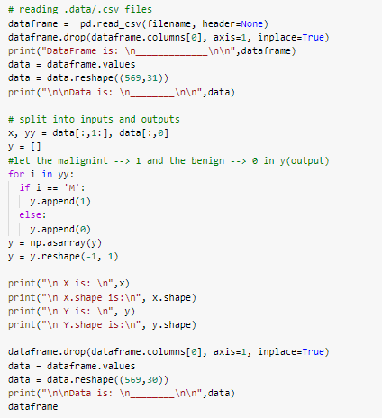

**Splitting data**

Split the data into train and test sets.
80% for the train and 20% for the test.

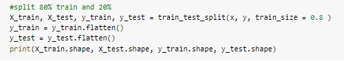

**Normalizing data**

Normalize data using min\_max\_scaler package from preprocessing from scikit\_learn python.
Applying a classifier on it.

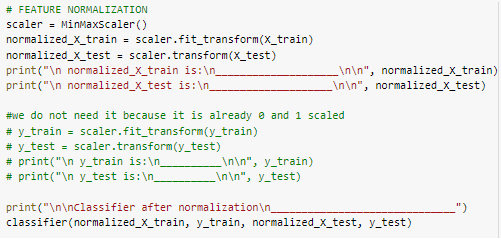

**Projecting data**

Projecting data using PCA with alpha 0.95.

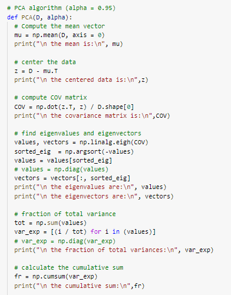

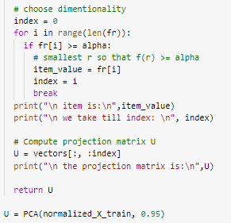

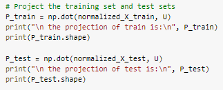

# **Classification**
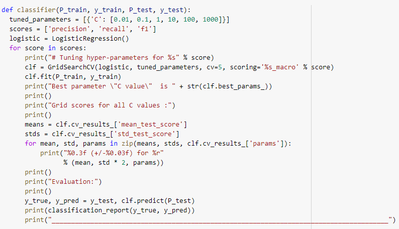

- Classifier function uses LogisticRegression(), GridSearchCV() to classify data with many values of C {0.01, 0.1, 1, 10, 100, 1000}.
- We make it three times, one for each of precision, recall, and F-measure to be the score that GridSerchCV uses to compare.
- Cross validation value is 5 as its default.
# **Evaluation**
It is implemented in the Classifier function using classification\_report from sklearn.metrics, prints accuracy for all Cs and the Evaluation for the best one of them.
# **Results**
## **Precision**
### **After Normalization:**
### Tuning hyperparameters failed to converge.
Evaluation:

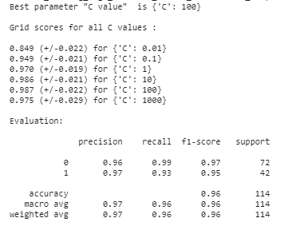 

### **After all Pre-processing**
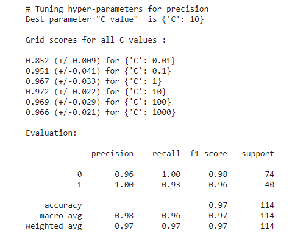

## **Recall**
### **After Normalization:**
### Tuning hyperparameters failed to converge.
Evaluation:

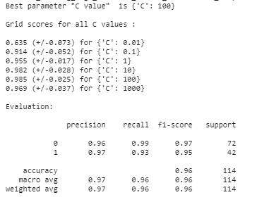

### **After all Pre-processing**
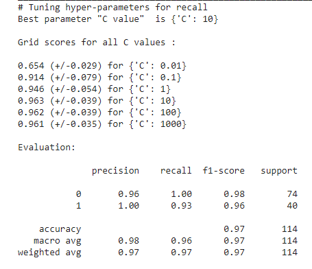

## **F-measure**
### **After Normalization:**
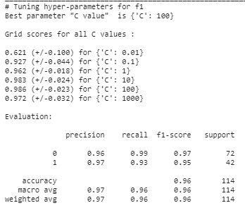
### **After all Pre-processing**
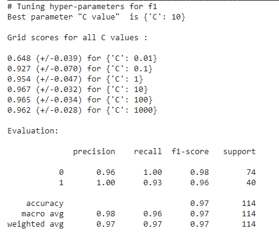

Image Classification
# **Softmax**
## **Regularization loss:**
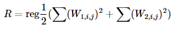
**Loss function:
` `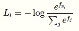**
-------------------------------------------------------------------
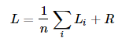
## **Gradient:**
\*  Xi
\*  Xi

Calculating the loss and gradient from the equations above.
## **softmax.py**
**Implementing the softmax\_loss\_naive**

Implement the function by calculating the loss and gradient from the equation attached above.
Doing the numeric instability trick by subtracting the log(c) which chosen to be the max of scores in the vector.
Do the normalization and regularization at the end of the function by dividing on N and adding the regularization term.

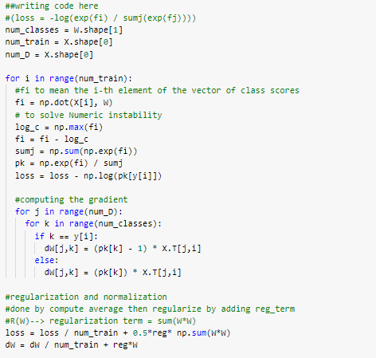

**Implementing the softmax\_loss\_vectorized**

We implement the loss function and gradient using the vectors in python by calculating all the matrices with one step instead of calculating each element.

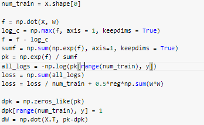

## **Linear\_classifier.py**
Updating weights by subtracting the learning rate (alpha) multiplied by gradient (dE/dw).
The negative of the Gradient shows the directions along which the weights should be moved in order to optimize the loss function.

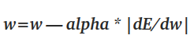

**def train()**

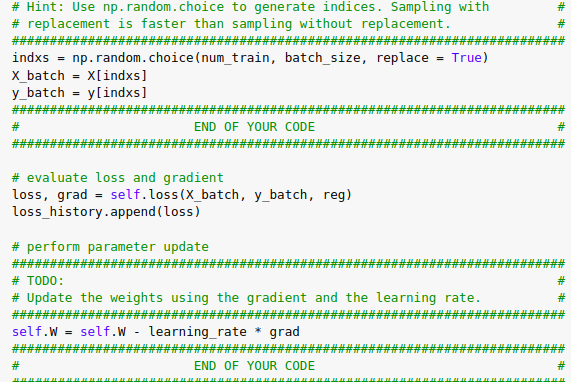

**def predict()**

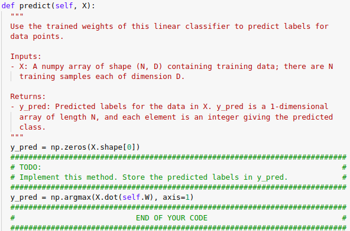

**Tuning hyperparameters**

` `Loop on different learning rates and regularization strengths.

Learning rates = [1e-8, 2e-7, 1e-7, 2e-6, 3e-5, 1e-3, 3e-3, 1e-2, 3e-2]

Regularization strengths = [0.5e3, 1e3, 0.5e4, 1e4, 2e4, 2.5e4, 3e4]

Best validation accuracy achieved during cross-validation: 0.378.

softmax on raw pixels final test set accuracy: 0.363.

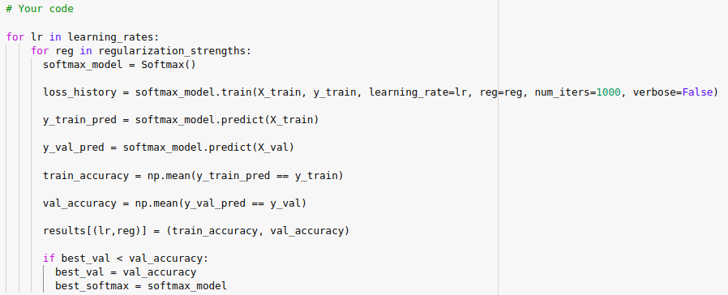

-----
# **Two Layer Net**
- Equations used
  - Z1 = X \* W1 + b1
  - a1 = max(Z1, 0)
  - Z2 = a1 \* W2 + b2

def loss(self, X, y=None, reg=0.0):

If y is None, return a matrix scores of shape (N, C) where scores[i, c] is the score for class c on input X[i]. If y is not None, instead return a tuple of:

`    `- loss: Loss (data loss and regularization loss) for this batch of training samples.

`    `- grads: Dictionary mapping parameter names to gradients of those parameters with respect to the loss function; has the same keys as self.params.

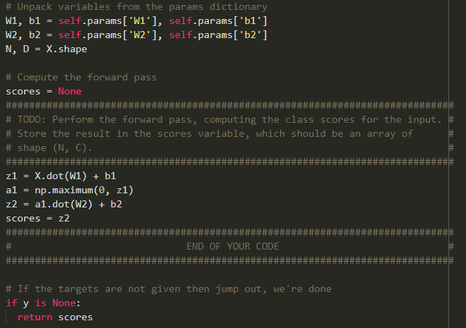

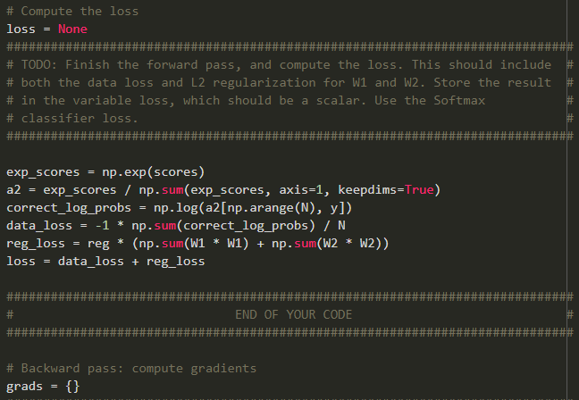

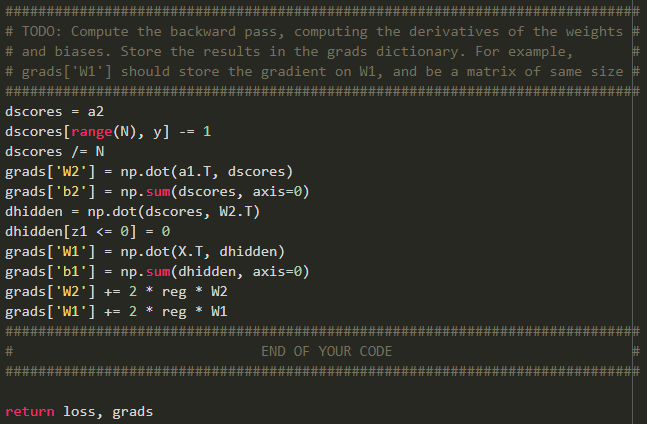

def train(self, X, y, X\_val, y\_val, learning\_rate=1e-3, learning\_rate\_decay=0.95, reg=5e-6, num\_iters=100, batch\_size=200, verbose=False):

Train this neural network using stochastic gradient descent.

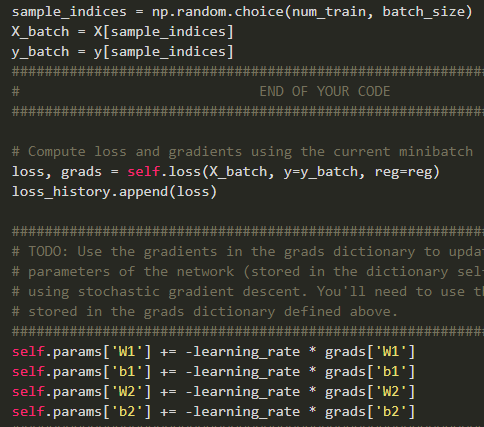

def predict(self, X):

Use the trained weights of this two-layer network to predict labels for data points. For each data point we predict scores for each of the C classes, and assign each data point to the class with the highest score.

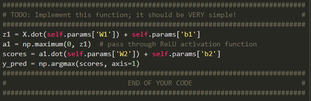

Tuning hyperparameters:

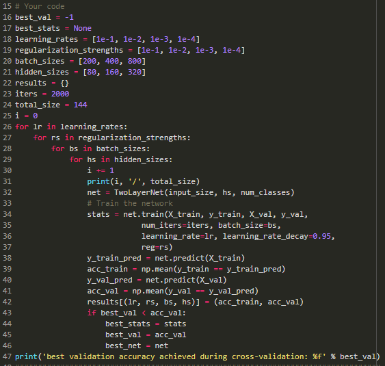

Best validation = 55%

Best accuracy achieved = 53%

-----
# **Features - Neural Network on image features**
Train a two-layer neural network on image features. Using cross validation on many parameters.

- learning\_rate\_decay = [0.9, 0.95, 0.99]
- regularization\_strengths = [1e-7, 1e-6, 1e-5, 1e-4, 1e-3]
- learning\_rates = [1e-1, 1]

Store the best of these parameters and its model.

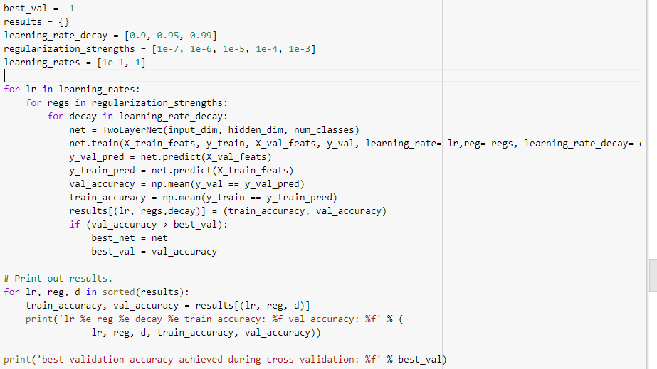
## **Result**
Best net was:

- lr 1.000000e+00 
- reg 1.000000e-07 
- decay 9.000000e-01 
- train accuracy: 0.681265 
- val accuracy: 0.600000

So best validation accuracy achieved during cross-validation: 0.600000

Test accuracy achieved: 0.57

# **Inline questions**
**Why do we expect our loss to be close to -log(0.1)? Explain briefly.\*\***

**Your answer:** *since there are 10 classes. So, the probability of each class is 1/10 which is 0.1 and the softmax loss is the negative log(probability of class). So, the loss will be -log(0.1).*

***It's possible to add a new datapoint to a training set that would leave the SVM loss unchanged, but this is not the case with the Softmax classifier loss.***

*Your answer: in case of softmax (True)*

*Your explanation: as all training points affect the softmax loss function because the softmax considers all points while calculations of loss.*

**Training on larger dataset & Increase the regularization strength will decrease the gap between train and test as :**

1. Training on larger dataset will prevent overfitting, adding more samples of each class with different variations will allow the model to generalize better, But if the samples were noisy or similar to the present samples they will not help.
1. More hidden units leads to learning more complex functions about the data which will lead to memorizing of the training data.
1. Increasing the regularization strength will reduce the complexity of the model and make it easier to train complex models which will avoid overfitting problems.

